## Practica Spring Boot

### Estructura del proyecto

### Servidor iniciado

### Respuesta de la API

### Respuesta de la API Students

### Estructura modular del proyecto

### Compilación y ejecución exitosa

## Importancia de la organización modular
La organización modular permite dividir la aplicación en componentes independientes según su funcionalidad. En este proyecto se separaron los módulos users y products, cada uno con sus respectivos controladores y servicios. Esta estructura es super util ya que facilita el mantenimiento del codigo y mejora la escalabilidad del proyecto, además de permitirnnos trabajar de manera simultanea sin generar conflictos.  

###  Productos creados en PostgreSQL

El flujo de datos entre la API REST y PostgreSQL se realiza mediante un ORM que traduce las peticiones HTTP en consultas SQL y viceversa, apoyándose en BaseEntity como un estándar de arquitectura. Al entrar, la petición procesa los datos y BaseEntity inyecta automáticamente campos clave como el id y las marcas de tiempo de auditoría (createdAt, updatedAt) antes de que el ORM ejecute la inserción o actualización en la base de datos. Al salir, PostgreSQL devuelve los registros, el ORM los convierte en objetos estructurados que heredan de BaseEntity, y finalmente la API los serializa en formato JSON para entregarlos al cliente.

### Respuesta 400 Bad Request al enviar los datos incorrectos.
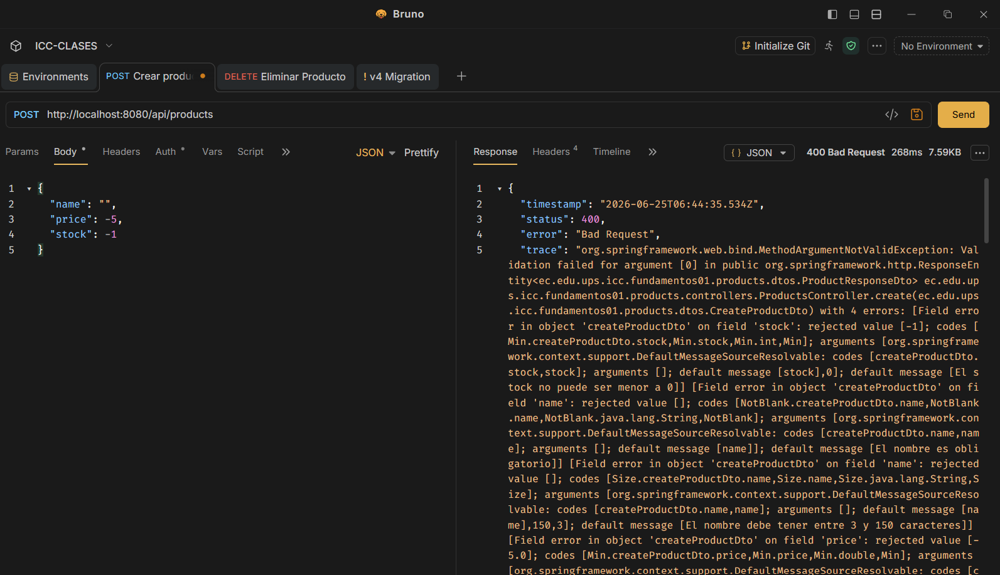

### Eliminación de un producto
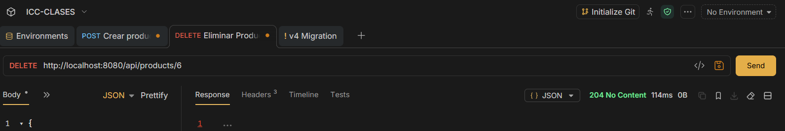

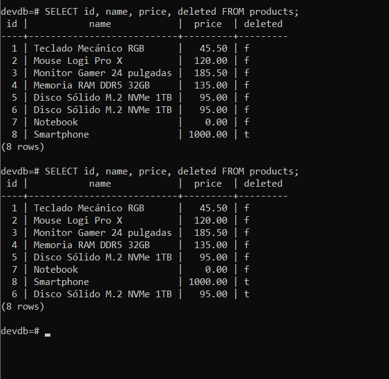

### Intento de eliminar un producto eliminado.

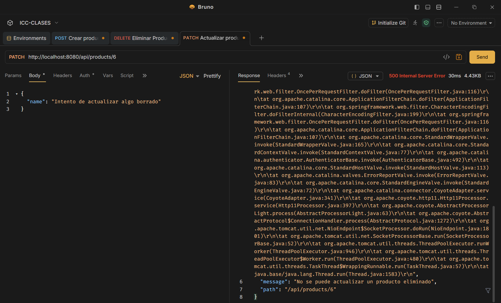

### Actualización Parcial de Contraseña
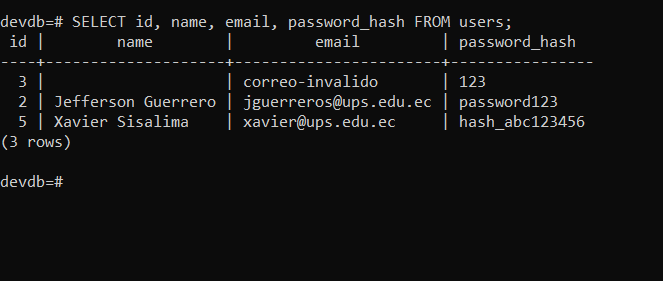

### Consulta de endpoint de productos con paginación
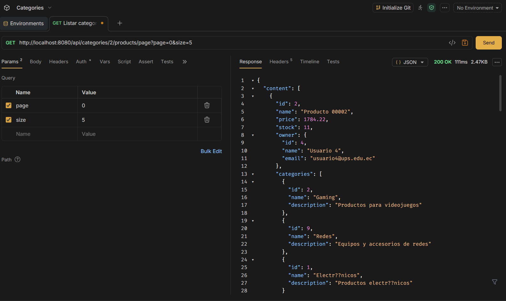
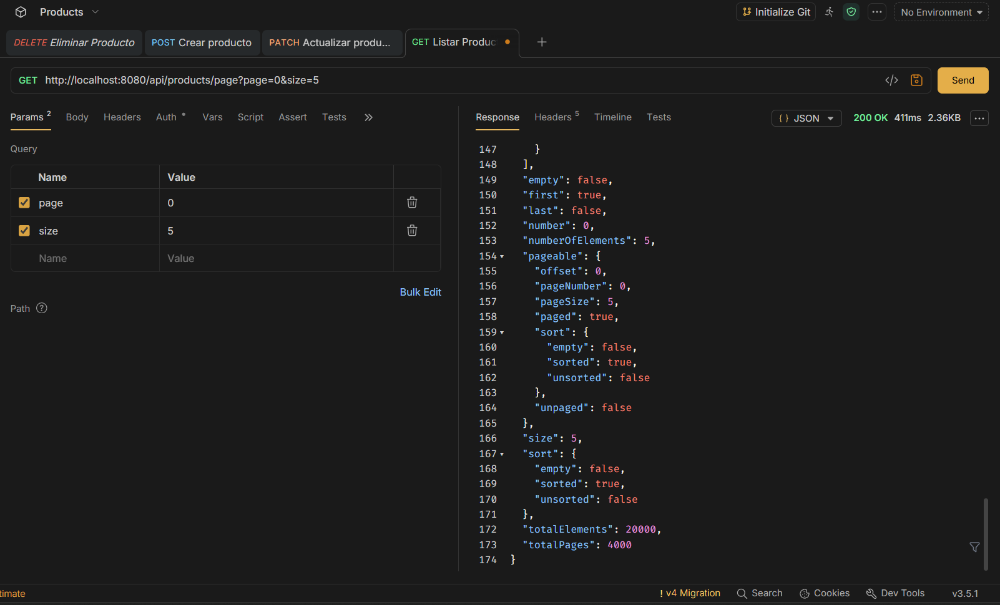
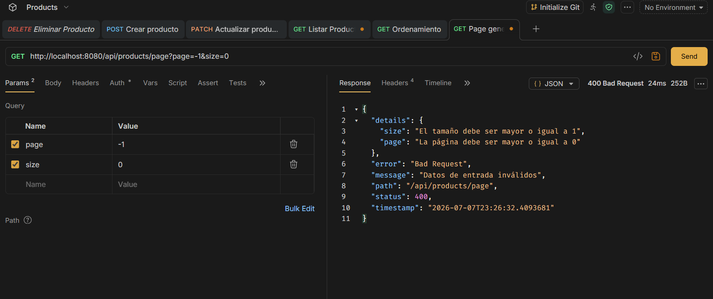

### Consulta de endpoint de productos con slice
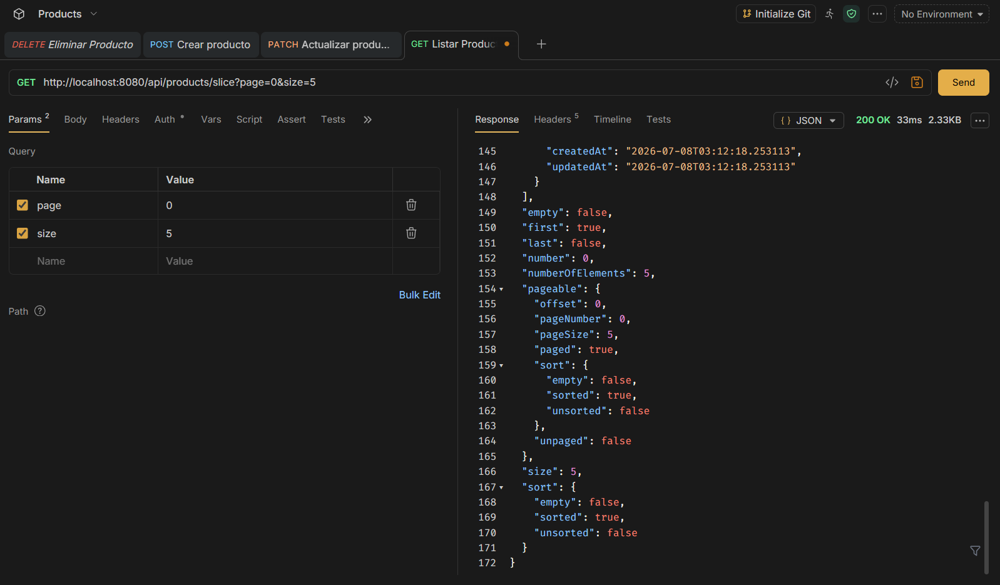

### ¿Cuál es la diferencia entre Page y Slice?
Page devuelve el total de elementos y páginas porque ejecuta una consulta COUNT, en cambio, slice solo indica si existe una página siguiente y es más ligero

### ¿Por qué la paginación debe aplicarse en el repositorio y no después de traer todos los datos en memoria?
Porque la base de datos aplica LIMIT y OFFSET antes de enviar los datos. Paginar después de traer todos los registros seguiría consumiendo memoria, tiempo y red innecesariamente.

### Registro exitoso
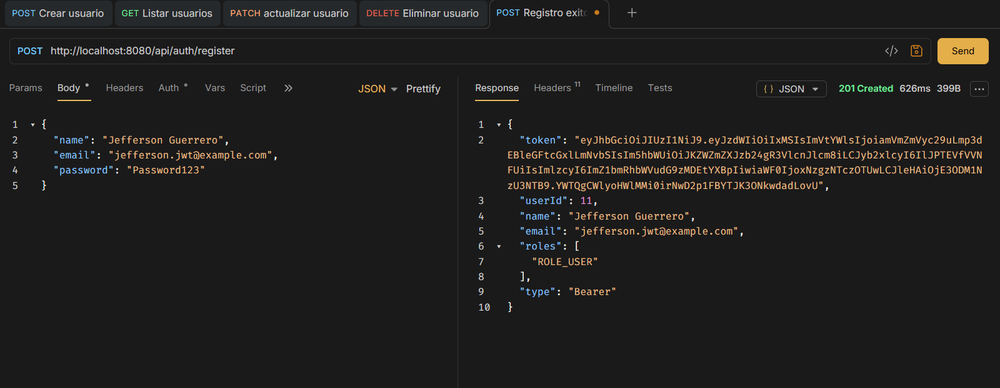

### Login exitoso
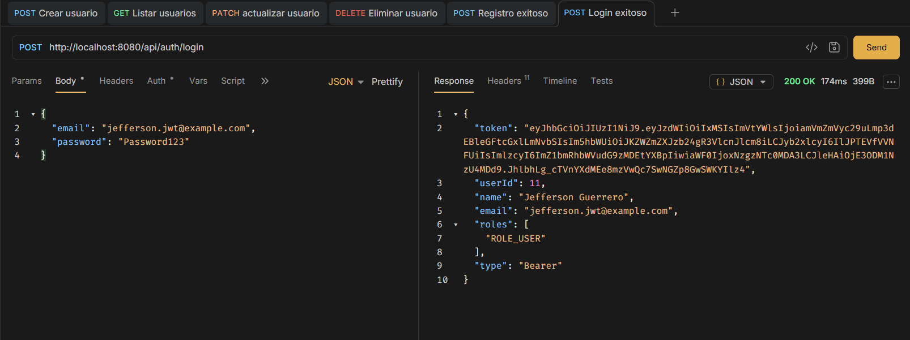

### Endpoint protegido sin token
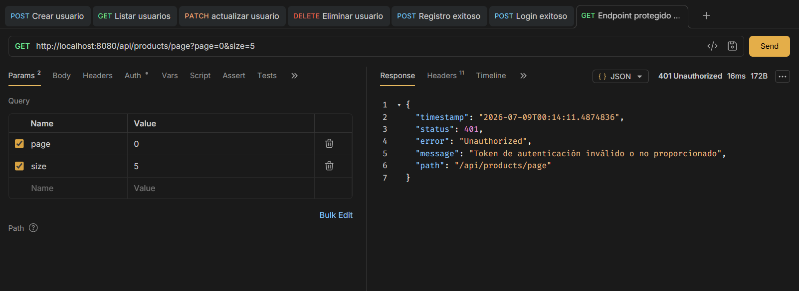

### Endpoint protegido con token
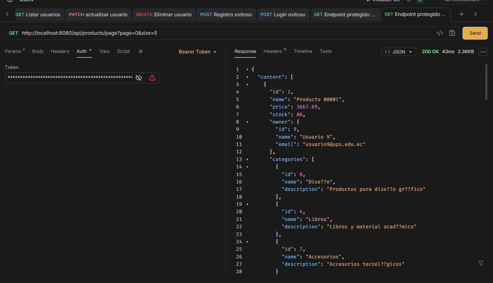

### Usuario autenticado
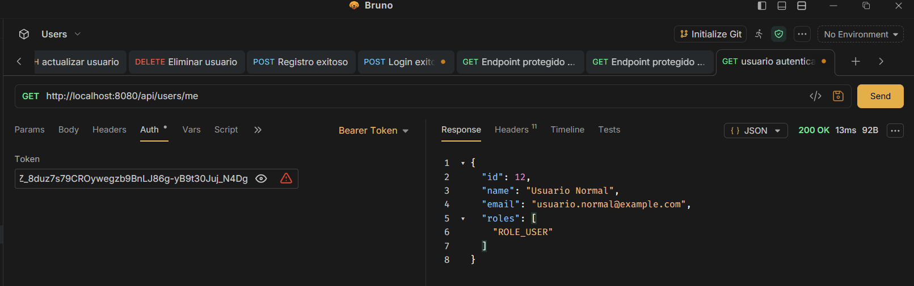

### Usuario no autenticado
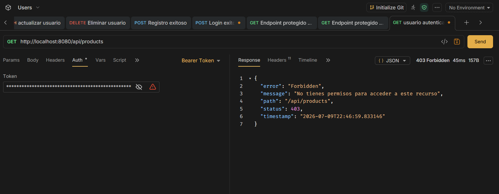

### Usuario autenticado como ADMIN
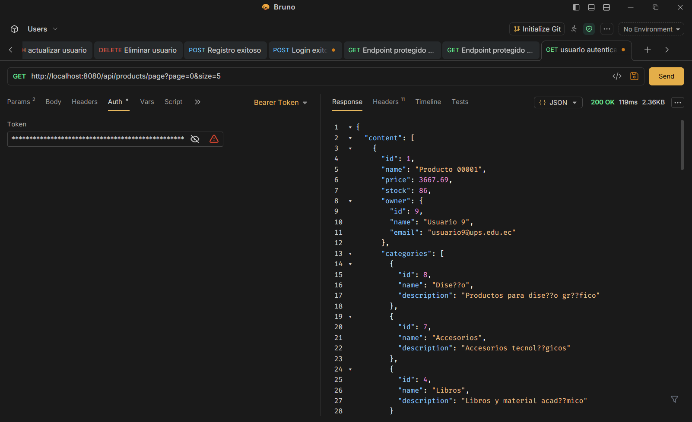

### Creación de producto con usuario autenticado
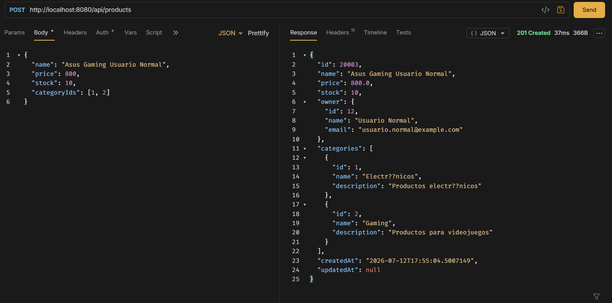

###  Bloqueo de actualización de producto ajeno
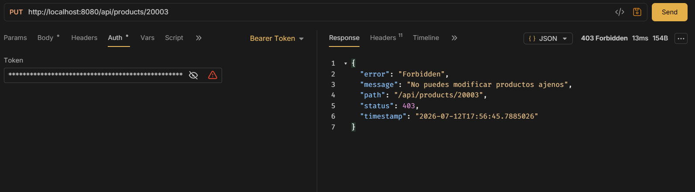

### Bloqueo de eliminación de producto ajeno
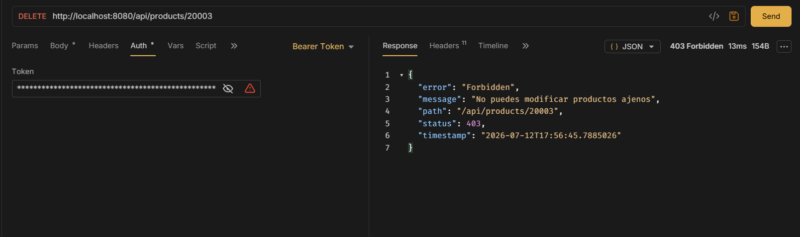

### ADMIN modificando producto ajeno
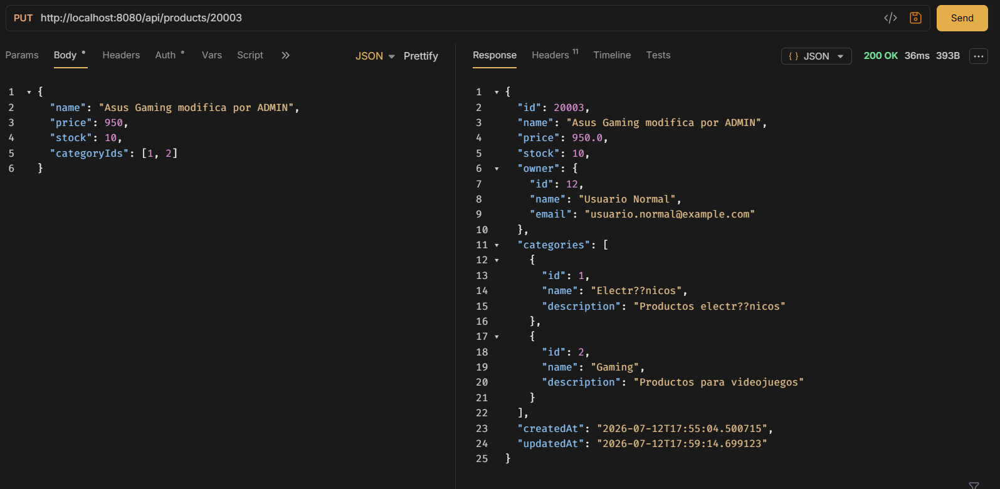

### Productos del usuario con ID
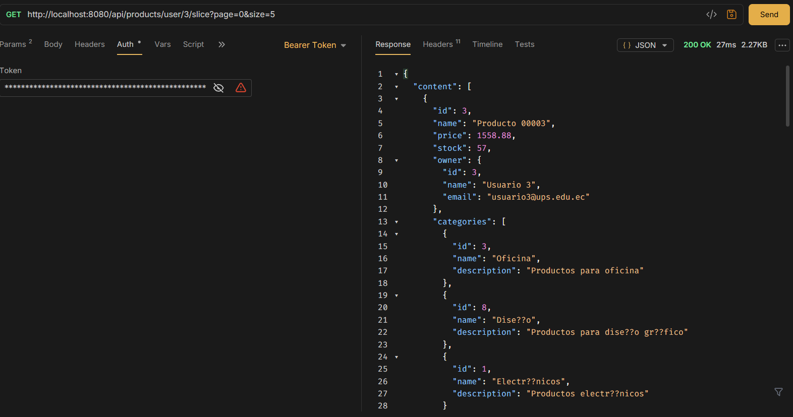
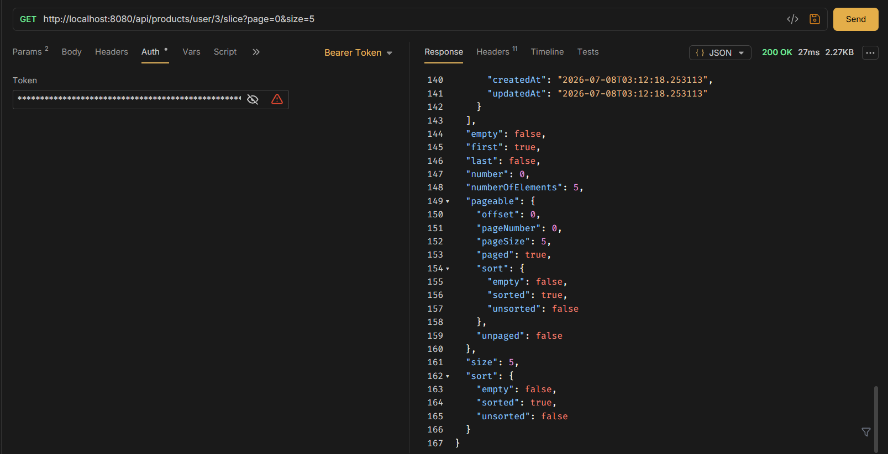

## Ejecución del proyecto con Docker

Se creó una imagen Docker del proyecto Spring Boot utilizando el archivo Dockerfile. Luego se ejecutó un contenedor llamado fundamentos01-app, conectado a la base de datos PostgreSQL mediante la red fundamentos-net.

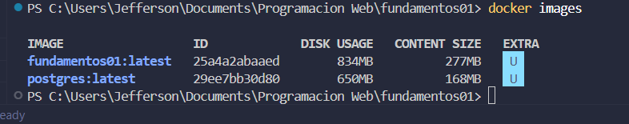

### Verificación

Se comprobó la ejecución con el comando docker ps, donde se evidenció que ambos contenedores estaban activos. Además, se probó el endpoint /api/status, obteniendo una respuesta correcta del servicio.

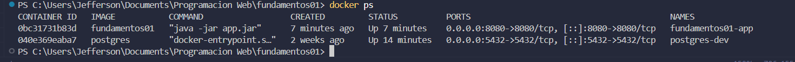
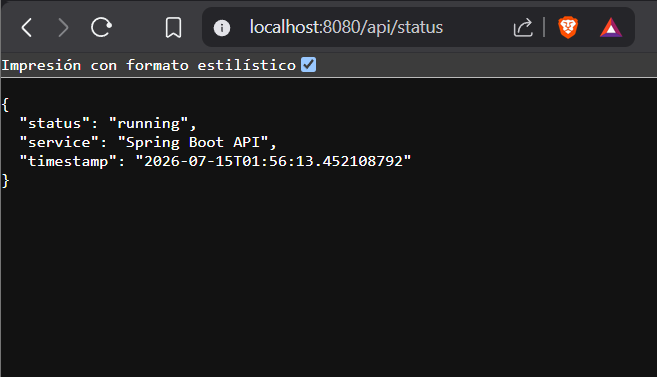

### Login con refresh token

### Refresh exitoso

### Logout

### Refresh después de logout

¿Cuál es la diferencia entre access token y refresh token?

El access token se utiliza para acceder a los endpoints protegidos del sistema. Tiene una duración corta y se envía en el encabezado Authorization como Bearer token.

El refresh token, en cambio, se utiliza únicamente para renovar el access token cuando este expira. Tiene una duración mayor y se envía en el cuerpo de la petición al endpoint /api/auth/refresh.

¿Por qué el refresh token no debe usarse en Authorization: Bearer?

El refresh token no debe usarse como Bearer token porque no está diseñado para acceder directamente a los recursos protegidos de la API. Su única función es renovar la sesión.

Por seguridad, el filtro JWT valida que los tokens usados en el encabezado Authorization sean únicamente de tipo access. De esta manera, si un usuario intenta usar un refresh token para consumir un endpoint protegido, el sistema lo rechaza con 401 Unauthorized.

¿Qué significa rotar un refresh token?

Rotar un refresh token significa que, cada vez que se usa para renovar la sesión, el refresh token anterior se revoca y se genera uno nuevo.

Esto evita que el mismo refresh token pueda reutilizarse indefinidamente. Si alguien intenta usar un refresh token antiguo, el sistema lo rechaza porque ya fue revocado.