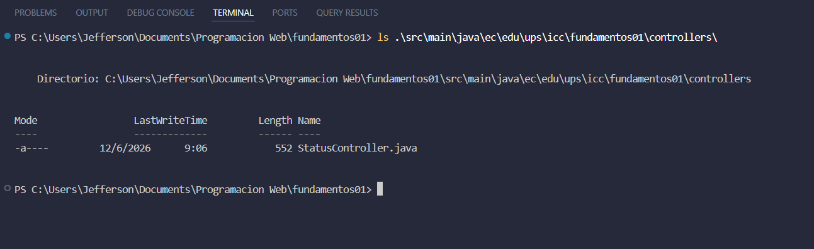
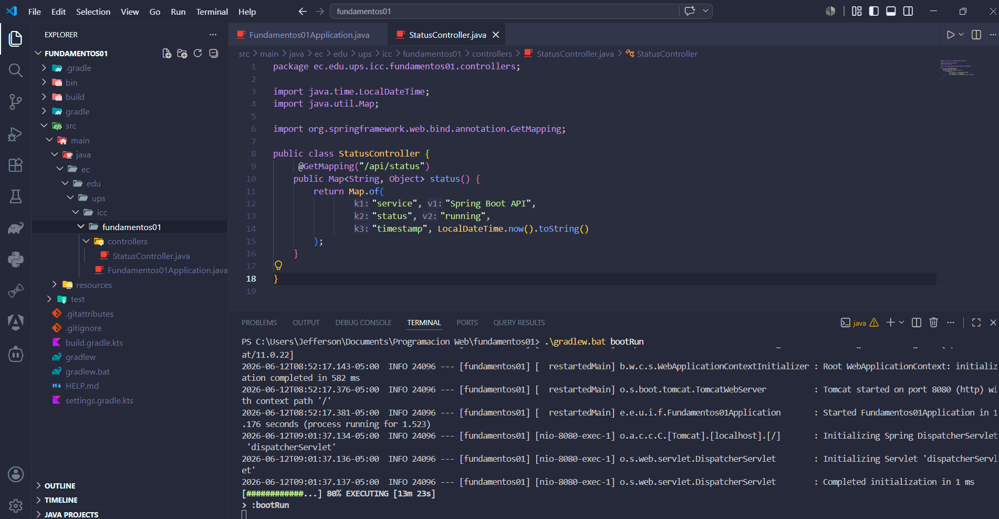
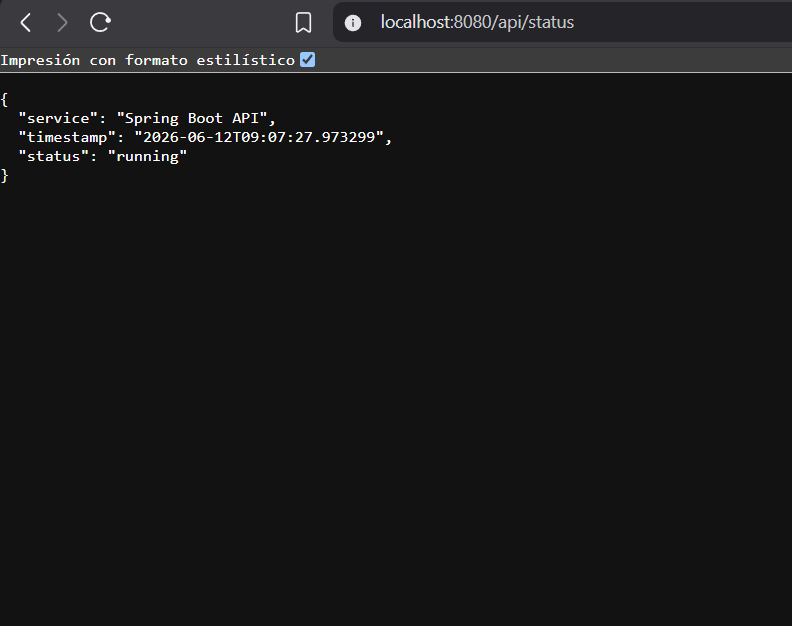
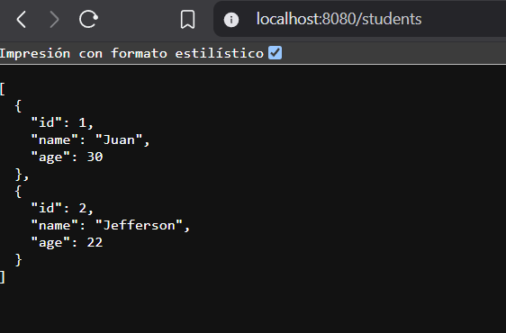
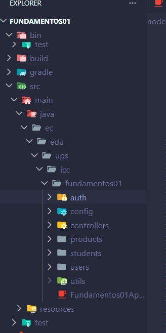
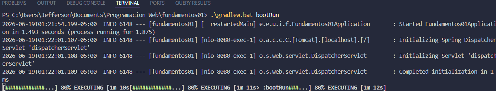
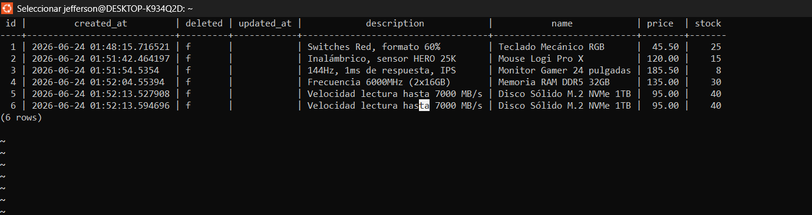

## Practica Spring Boot

### Estructura del proyecto

### Servidor iniciado

### Respuesta de la API

### Respuesta de la API Students

### Estructura modular del proyecto

### Compilación y ejecución exitosa

## Importancia de la organización modular
La organización modular permite dividir la aplicación en componentes independientes según su funcionalidad. En este proyecto se separaron los módulos users y products, cada uno con sus respectivos controladores y servicios. Esta estructura es super util ya que facilita el mantenimiento del codigo y mejora la escalabilidad del proyecto, además de permitirnnos trabajar de manera simultanea sin generar conflictos.  

###  Productos creados en PostgreSQL

El flujo de datos entre la API REST y PostgreSQL se realiza mediante un ORM que traduce las peticiones HTTP en consultas SQL y viceversa, apoyándose en BaseEntity como un estándar de arquitectura. Al entrar, la petición procesa los datos y BaseEntity inyecta automáticamente campos clave como el id y las marcas de tiempo de auditoría (createdAt, updatedAt) antes de que el ORM ejecute la inserción o actualización en la base de datos. Al salir, PostgreSQL devuelve los registros, el ORM los convierte en objetos estructurados que heredan de BaseEntity, y finalmente la API los serializa en formato JSON para entregarlos al cliente.